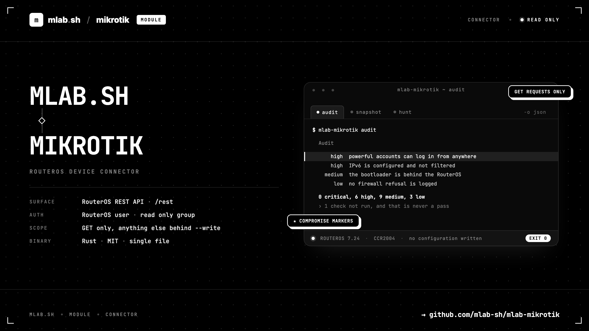

# mlab-mikrotik



**A CLI over the MikroTik RouterOS REST API, built as a base for passive
network security work.**

It talks to one router over `<scheme>://<host>/rest`, authenticating with a
RouterOS user and password, and an *instance* in `$HOME/.mlab/mikrotik.conf`
says which router to reach and how.

It reads. Every wrapped command issues nothing but GET requests, and the one
command that can send anything else refuses to until you pass `--write`.

Requires RouterOS 7.1 or later. Tested against 7.24.2 on a CCR2004.

## Install

**Homebrew** (macOS and Linux)

```bash
brew tap mlab-sh/mlab-mikrotik https://github.com/mlab-sh/mlab-mikrotik.git
brew install mlab-mikrotik
```

**Debian and Ubuntu**: download the `.deb` for your architecture from the
[releases page](https://github.com/mlab-sh/mlab-mikrotik/releases), then:

```bash
sudo apt install ./mlab-mikrotik_0.1.0_amd64.deb
```

**Fedora, RHEL and rebuilds**: the same with the `.rpm`:

```bash
sudo dnf install ./mlab-mikrotik-0.1.0-1.x86_64.rpm
```

**Prebuilt binary** (macOS and Linux, x86_64 and arm64): a tarball from the
same page. The Linux builds are linked against glibc 2.35, so Debian 12 and
Ubuntu 22.04 and newer.

Nothing signs these assets, so every release carries a `SHA256SUMS` covering
all of them:

```bash
sha256sum -c --ignore-missing SHA256SUMS
```

**From source** (a recent Rust toolchain):

```bash
git clone https://github.com/mlab-sh/mlab-mikrotik.git
cd mlab-mikrotik && cargo build --release
```

## On the router

REST is served by the web services, which are off on a hardened device. Turn on
the TLS one and give the CLI its own account — the group matters more than it
looks, see [Account](wiki/Account.md):

```
/ip service enable www-ssl
/user group add name=mlab-audit policy=read,rest-api,api,!sensitive,!write,!policy,!reboot,!sniff,!romon,!ftp,!password
/user add name=mlab group=mlab-audit password=... address=203.0.113.10/32
```

The built-in `read` group is **not** a reading group: it carries `sensitive`
(keys and passwords in clear text), `reboot`, `sniff` and `romon`. `whoami`
reports every one of them.

## First run

```bash
mlab-mikrotik login --name lab --host 192.0.2.1 --user mlab
mlab-mikrotik whoami
mlab-mikrotik audit
```

`login` prompts for the password without echoing it, tests the credentials, and
writes the config file `0600` in a `0700` directory. A failed test writes
nothing.

## Commands

| Command | What it does |
| --- | --- |
| [`audit`](wiki/Audit.md) | Every graded check in one report. Start here. |
| [`whoami`](wiki/Whoami.md) | What this account is, and everything it is allowed to read. |
| [`info`](wiki/Info.md) | What this router is: software, hardware, licence, health. |
| [`interfaces`](wiki/Interfaces.md) | The ports: state, addresses, and what is dropping packets. |
| [`clients`](wiki/Clients.md) | What the router knows about who is on the network. |
| [`network`](wiki/Network.md) | Addresses, bridges, VLANs, DHCP and routes. |
| [`topology`](wiki/Topology.md) | The neighbours this router hears, and what it announces itself. |
| [`firewall`](wiki/Firewall.md) | The rules, and whether each chain closes. |
| [`exposure`](wiki/Exposure.md) | What this router offers to anything that can reach it. |
| [`posture`](wiki/Posture.md) | The settings that claim to defend something. |
| [`wifi`](wiki/Wifi.md) | The radios, their security, and who is associated. |
| [`snapshot`](wiki/Snapshot.md) | One dated, secret-free record of everything this account can read. |
| [`diff`](wiki/Diff.md) | What changed between two snapshots. |
| [`shadow`](wiki/Shadow.md) | What turned up that nobody announced. |
| [`patch`](wiki/Patch.md) | How far behind this router is, in RouterOS and in its bootloader. |
| [`vuln`](wiki/Vuln.md) | The published advisories that cover this exact version. |
| [`footprint`](wiki/Footprint.md) | What this router looks like from outside. |
| [`hunt`](wiki/Hunt.md) | The markers a compromised MikroTik router leaves behind. |
| [`logging`](wiki/Logging.md) | Where the log goes, and what never reaches it. |
| [`blast`](wiki/Blast.md) | What a compromised host on one segment reaches. |
| [`api`](wiki/Api.md) | Raw request against any menu, for what is not wrapped yet. |
| [`login`](wiki/Login.md) | Create or update an instance, prove it works, save it. |
| [`ping`](wiki/Ping.md) | Check that the current instance reaches its router. |
| [`profile`](wiki/Configuration.md) | List, show, select and delete saved instances. |
| [`config`](wiki/Configuration.md) | Where the config file is, and what is in it. |

Every command renders to the terminal by default and to raw JSON with
`-o json`. See [Output](wiki/Output.md).

## Documentation

Everything lives in the **[wiki](wiki/Home.md)**, one page per command plus the
concepts they rest on:

- [Account](wiki/Account.md) — the RouterOS user this CLI logs in as, and why
  the built-in `read` group gives a read-only tool more power than intended.
- [Checks](wiki/Checks.md) — the catalogue of graded findings, what each one
  means, and the two rules that decide whether something may appear at all.
- [Secrets](wiki/Secrets.md) — what never reaches the disk, and why the field
  list is explicit rather than a substring rule.
- [Enrichment](wiki/Enrichment.md) — everything that leaves this machine, all
  of it behind `--allow-web`, and why the router never makes the call itself.
- [Surfaces](wiki/Surfaces.md) — the one API a router answers on, what a read
  account actually reaches, and the six quirks that shape every command.
- [Configuration](wiki/Configuration.md) — instances, precedence, and where the
  password lives.
- [Output](wiki/Output.md) — the terminal render, the JSON, and the rules that
  keep the two from mixing.
- [Roadmap](wiki/Roadmap.md) — what is built and what is next.
- [Releasing](wiki/Releasing.md) — how a version becomes a Homebrew formula, a
  `.deb` and an `.rpm`.

## Configuration

Settings resolve in one order, each layer overriding the one before it: the
stored instance, then the environment (`MLAB_MIKROTIK_*`, then `MIKROTIK_*`),
then the flags.

| Flag | Environment | In the file |
| ---- | ----------- | ----------- |
| `--host` | `MIKROTIK_HOST` | `host` |
| `--user` | `MIKROTIK_USER` | `user` |
| `--password` | `MIKROTIK_PASSWORD` | `password` |
| `--scheme` | `MIKROTIK_SCHEME` | `scheme` |
| `--insecure` / `--secure` | `MIKROTIK_INSECURE` | `insecure` |
| `--output` | `MIKROTIK_OUTPUT` | `output` |

`MLAB_MIKROTIK_CONFIG` moves the config file itself. Given a host and a user,
the CLI runs with no config file at all:

```bash
MIKROTIK_PASSWORD="$ROUTER_PASSWORD" mlab-mikrotik ping --host 192.0.2.1 -u mlab -o json
```

## Where the password lives

RouterOS issues no API token. Basic auth sends the password itself on every
request, so the CLI has to keep something it can replay: the config file holds
it as typed, `0600` inside a `0700` directory, and a warning fires if those
permissions ever loosen. Nothing prints it back — `profile show` and
`config show` mask it — and `MIKROTIK_PASSWORD` is preferred over
`--password`, because a command line is visible to every user on the machine.

## Layout

```
src/
  main.rs        entry point
  cli/           the clap surface, and the context a command runs in
  commands/      one file per command
  ros/           the HTTP client, and the stored instances
  collect.rs     one pass over what the account can read, and what it cannot
  checks/        the graded checks, as pure functions over collected data
  enrich/        everything that leaves this machine, all of it opt-in
  snapshot.rs    the dated record, and the rules for comparing two of them
  secrets.rs     the fields that never reach the disk
  ui/            the terminal render and the progress rules
wiki/            the documentation, mirrored to the GitHub wiki
.github/
  workflows/     the release pipeline and the wiki mirror
```

## Scope

Phases one to five: **reading**, **hardening**, **recording**,
**correlating**, **hunting**.

Everything is passive. Three commands can reach the network, each behind
`--allow-web`, each sending a version string or a public address and nothing
else — and none of them ever asks the *router* to contact anyone.

There is no event stream on a RouterOS device, so detection is differential:
you do not read an alarm, you compare two dated collections.

```bash
mlab-mikrotik snapshot && mlab-mikrotik shadow
```


Two rules govern what may appear as a finding. A severity is about what it
costs, not how it looks: a control that is simply switched off is usually a
decision and stays out, while a control that *reads as* protection without
being one belongs in the report. And a check that could not run produces
nothing — never a pass — with the skipped count printed in every report,
including a clean one.

```bash
mlab-mikrotik audit --fail-on high
```

## Licence

MIT.
